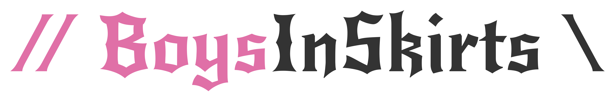

# BoysInSkirts.org — Project Information

## 1. Executive summary

BoysInSkirts.org (BIS) is an informational and advocacy website that promotes gender equality in clothing and normalizes skirts as an option for boys and men. The public site will combine editorial content with an engaging hero experience: a 3D virtual try-on (VT) system that demonstrates how skirts look on a variety of human models. The project is built around a small, tailored headless CMS that feeds structured data to both the public site and the admin panel. The CMS will also manage human model assets and skirt patterns and expose APIs for the 3D renderer.

Primary goals:

- Deliver a lightweight, performant public website with accessible content and an immersive VT hero.
- Build a flexible headless CMS that allows non-technical editors to author content, manage models, and manage skirt assets.
- Provide an admin panel to manage site content and model/skirt assets.
- Ensure privacy, accessibility, and good performance across devices.

## 2. Objectives & success metrics

Primary objectives:

- Publish core editorial content (landing, about, blog/articles, FAQs, legal pages).
- Deliver a functioning VT hero that renders 3–6 base human models with selectable skirts and basic fit/pose switching.
- Provide a CMS for editors to manage pages, media, human models, skirt assets.
- Achieve accessible experience (WCAG AA), maintain privacy-compliant tracking, and fast page loads (Lighthouse performance score >= 80).

## 3. Audience & user personas

- General public / curious visitors — lightweight information, easy-to-consume content.
- Supporters & advocates — deeper content, shareable assets.
- Editors / Campaign managers — non-technical users who manage content and models.
- Technical admins — manage deployments, assets, and integrations.

## 4. Scope

In-scope (MVP):

- Headless CMS with user auth, JWT-based API, content pages (WYSIWYG or structured blocks), media library.
- CMS content types: Page with custom fields, Static pages (terms/privacy), Hero configuration (which model/skirt to display).
- Model management: unified system for both human models and skirt assets with metadata, preview images, and categorization.
- Model assets: upload 3D files (glTF), CRUD, preview thumbnails; support for both pre-made 3D models and parametrically generated patterns.
- Main website (React + Three.js): landing page with hero VT, content pages, basic responsive UI components.
- Admin panel (React): CMS UI, model management, content preview, privacy-focused analytics dashboard.
- Privacy-first analytics: self-hosted, anonymous session tracking, event tracking (page views, VT interactions), cookie consent with opt-out, no personal data collection, IP anonymization.
- Authentication for CMS/Admin with JWT and RBAC (Editor, Admin).
- CI/CD and automated tests for critical paths.
- All file and asset management is handled by the CMS and its REST APIs. No CDN or S3 is used; all uploads and downloads are managed by the backend.

Out-of-scope (for MVP):

- Full ecommerce, payment processing.
- Advanced user customization (body scanner via camera, measurement capture).
- Social features (comments, user accounts for public users).
- Ads network integrations (can be planned for Phase 2).
- Heavy ML-based skirt generation (optional later).

## 5. High-level architecture

- Headless CMS (Spring Boot, MySQL) — exposes RESTful JSON APIs for content, models, assets, and serves all uploaded files directly.
- Main Website (React + TypeScript) — client-side app using Tailwind CSS and Material UI for components; Three.js for 3D VT.
- Admin Panel (React + TypeScript) — SPA that consumes CMS APIs; shares UI library.
- Storage: MySQL for structured data; all media and 3D assets are stored and served by the CMS backend.
- Auth: JWT issued by CMS for admin panel and internal API auth. Admin UI protected by RBAC.
- Analytics: Privacy-first analytics (Plausible or self-hosted Matomo) + optional server-side event tracking.
- Infrastructure: Dockerized services, Kubernetes or managed container service (ECS/Fargate), Terraform for infra as code (optional).

Diagram (conceptual):
Public Browser <-> **CMS REST API** (Spring Boot, serves all content and assets) -> MySQL, local file storage
Admin Browser <-> **CMS REST API** (auth required)

---

## 6. Tech stack (recommended)

- Backend / CMS: Spring Boot (Java 17+), Spring Security (JWT), Spring Data JPA, MySQL / Aurora MySQL.
- Frontend: React + TypeScript + Vite, Tailwind CSS, Material UI (component lib), Three.js / react-three-fiber for 3D rendering.
- **Asset storage & serving: All files managed and served by the CMS backend (no S3/CDN).**
- Auth: JWT; optionally integrate with OAuth2 for external logins (admins only).
- CI/CD: GitHub Actions (build/test/containers), automated deployment to staging & prod.
- Monitoring: Sentry for errors, Prometheus/Grafana for infra metrics, Cloud provider monitoring.
- Analytics: Self-hosted privacy-first analytics built into the CMS (simplified GA4 alternative with anonymous session tracking, event tracking, and cookie consent management).
- Optional: Node microservice for heavy 3D processing/skirt generation offline.

Rationale: chosen stack balances familiarity, scalability, and the mature Java ecosystem for server side control of CMS data shapes and APIs.

---

## 7. Detailed feature breakdown

7.1 Headless CMS

- Authentication & RBAC:
  - Login (username/password), JWT token issuance, token refresh.
  - Roles: Admin, Editor.
- Content types:
  - Content Blocks: (rich text, image, embed).
  - Page: All pages including static pages like privacy policy.
  - **The landing page** layout is hardcoded, but the content can be fetched via REST APIs.
- Custom fields:
  - Simplified ACF-like system for: text, textarea, rich text (Markdown), image, select, boolean, assets, nested groups.
  - Ability to define page templates and which fields are editable via field definitions.
  - Field instances attached to pages with metadata support.
- Media library:
  - Upload, automatic image resizing, thumbnails, metadata, reference counting, alt text for accessibility.
- Model management (unified for human models and skirt assets):
  - CRUD, name, category (human_model or skirt_asset), file path to glTF/GLB.
  - Metadata system using model_meta table for flexible attributes:
    - Human models: body_type (slim, average, plus-size), skin_tone, tags, anchor_map (JSON), pose.
    - Skirt assets: style, compatible_models (JSON array of model IDs), anchor (JSON for bone/offset/rotation), parameters_schema (JSON for procedural generation).
  - Preview thumbnails via preview_image reference.
- Skirt generator (see section 8).
- API:
  - RESTful endpoints for all content with pagination, filtering, caching headers.
  - Public read endpoints without auth (for public site).
  - Admin endpoints behind JWT.
- Versioning:
  - Basic page drafts and publish workflow via status field (draft, published, archived).
- Privacy-first analytics (self-hosted):
  - Anonymous session tracking with generated session IDs (no cookies unless consent given).
  - Event tracking: page views, VT interactions (model_switch, skirt_switch), engagement metrics.
  - IP anonymization (store country only).
  - Cookie consent management with opt-out capability.
  - No personal data collection; no cross-site tracking.
  - Aggregated metrics only in admin dashboard.
- Webhooks:
  - On publish, trigger cache purge/CDN invalidation.

7.2 Main Website (Public)

- Landing page:
  - Hero with 3D VT: loads base model + default skirt.
  - Model + skirt selector (popovers) with thumbnails.
  - Accessible controls for non-3D fallback (image or video).
- Content pages:
  - Rendered from CMS content blocks; support SEO meta tags and OpenGraph.
- Legal pages (terms, privacy).
- Progressive enhancement: provide content primarily; defer heavy 3D assets behind user interaction or lazy-load.
- Accessibility:
  - Keyboard navigable, semantic HTML, ARIA labels for 3D controls, color contrast.
- Performance:
  - Lazy-load 3D assets, compress models, use LODs, serve via CDN.

7.3 Admin Panel

- Login + MFA optional.
- Content editor:
  - WYSIWYG / structured editor for blocks, preview button (desktop + mobile).
- Unified model management UI:
  - Upload, preview, categorize (human_model or skirt_asset), add metadata.
  - Tag and assign models to hero presets.
- Publish workflow:
  - Draft, review, publish; preview as public.
- Privacy-focused analytics dashboard:
  - Page view metrics (top pages, unique sessions, views over time).
  - VT engagement metrics (model switches, skirt switches, interaction duration).
  - Anonymous event aggregations only.
  - Consent rate tracking.
  - No personally identifiable information displayed.
  - Country-level geographic data only.
- Role management:
  - Invite users, assign roles.

---

## 8. Skirt generation algorithm (strategy & options)

This is a core differentiator. There are three practical approaches; choice depends on budget and timeline.

Option A — Pre-made 3D assets (MVP)

- Maintain a curated library of glTF/GLB skirt models (different styles, sizes).
- For each human model, provide fitted versions or use simple attach points (skirt parented to hip bone).
- Pros: reliable, faster to implement.
- Cons: less customizable.

Option B — Parametric / procedural skirt generator (recommended Phase 2)

- Use a generator that creates skirt geometry from parameters (length, waist circumference, fullness, pleat count, fabric drape).
- Implementation:
  - Server-side Node or Java microservice that outputs optimized glTF for given parameters.
  - Use cloth-simulation-free approach (baked geometry), or precomputed drape LODs.
- Pros: flexible customization, smaller asset library.
- Cons: requires algorithm development and asset pipeline.

Option C — ML-driven or physics-based simulation (advanced)

- Use machine learning (e.g., conditional generative models) or GPU-based cloth simulation to generate realistic drapes for arbitrary body shapes.
- High complexity and compute; better for later phases or research.

MVP recommendation: Option A for launch — curated glTF models with standardized anchor points and a system to tag compatibility with human models. Plan Option B for Phase 2 for user customization & smaller UX friction.

Integration details:

- Each skirt asset includes metadata: anchor offsets, collisions (optional), recommended scale, compatible body types, and a fallback image.
- CMS exposes generator endpoints (if implemented) that accept parameters and return a downloadable glTF and thumbnail.

---

## 9. Data model (high-level)

Entities:

- User {id, username, email, role, hashed_password, is_active, created_at, updated_at, last_login_at}
- Page {id, title, slug, status, template, content, author_id, published_at, created_at, updated_at}
- Field {id, parent_id, name, handle, type, description, created_at, updated_at}
- PageField {id, page_id, field_id, field_name, field_handle, field_type}
- PageFieldMeta {id, pf_id, meta_key, meta_value}
- PageMeta {id, page_id, meta_key, meta_value}
- File {id, name, file_path, mime_type, size, width, height, alt_text, uploaded_by, created_at}
- Model {id, name, file_path, category (human_model|skirt_asset), preview_image_id, created_at, updated_at}
- ModelMeta {id, model_id, meta_key, meta_value} — stores flexible attributes like body_type, style, anchor_map, compatible_models, etc.
- AnalyticsSession {id, session_id, anonymous_id, started_at, last_active_at, user_agent, country, consent_given}
- AnalyticsEvent {id, session_id, event_type (page_view|vt_interaction|model_switch|skirt_switch), page_path, page_title, event_data:json, created_at}

API patterns:

- /api/pages?slug=landing — public read
- /api/models?category=human_model — public read (limited metadata)
- /api/models?category=skirt_asset — public read (limited metadata)
- /api/admin/models — authenticated CRUD
- /api/admin/analytics/sessions — authenticated read (aggregated data only)
- /api/admin/analytics/events — authenticated read (aggregated data only)
- /api/analytics/track — public POST for event tracking (respects consent)
- /api/skirt-generator (POST parameters) — (optional) returns glTF or job id

---

## 10. Security & privacy

Security:

- Use HTTPS everywhere.
- JWT tokens with reasonable expiry + refresh tokens.
- Rate limiting on public APIs.
- Validation and sanitization for uploaded assets (virus scan, mime checks).
- Least-privilege principle for service accounts.

Privacy:

- Minimal data collection — no personal data from public visitors unless they sign up.
- Self-hosted privacy-first analytics (simplified GA4 alternative):
  - Anonymous session tracking using generated session IDs.
  - IP anonymization: store country only, no full IP addresses retained.
  - Cookie consent UI with clear opt-out capability.
  - No third-party analytics services or data sharing.
  - No cross-site tracking or fingerprinting.
- For VT usage tracking: aggregate anonymous events (model switches, skirt switches, interaction duration) without device-level linkage.
- Admin dashboard shows only aggregated metrics, no individual user paths or identification.
- Provide clear privacy policy explaining what data is collected and how it's used.

Compliance: design with GDPR/CCPA considerations — DSAR handling process if user data collected. Right to be forgotten for users who create accounts.

## 11. Accessibility

- Target WCAG 2.1 AA across public site.
- Ensure 3D VT controls have accessible alternatives (simple image fallback, keyboard controls).
- Provide descriptive alt text for images and 3D content descriptions.
- Color contrast checks, focus indicators, semantic markup.

## 12. Performance & optimization

- Lazy-load 3D assets and defer heavy scripts until after hero content visible or on user interaction.
- Use compressed glTF (DRACO) and LODs.~
- Monitor Lighthouse and set budget (bundle size targets).

## 14. Deployment & infra

- Environments: local dev, staging, production.
- Containerize backend and optional asset-processing services.
- Recommended hosting: managed Kubernetes (EKS/GKE/AKS) or ECS Fargate for smaller ops footprint.
- Use RDS / managed MySQL for database.
- **All assets and media are stored and served by the CMS backend; no S3 or CDN.**
- CI/CD: GitHub Actions — build, test, push images, deploy to staging then production with controlled rollout.
- Backups: DB daily, assets replicated.

### Assigned Domains

**Staging:**

- <dev-bis-cms.boysinskirts.org>: Staging CMS
- <dev-bis-mgt.boysinskirts.org>: Staging Admin
- <dev-bis-www.boysinskirts.org>: Staging Public Website

**Production:**

- <prd-bis-cms.boysinskirts.org>: Production CMS
- <prd-bis-mgt.boysinskirts.org>: Production Admin
- <www.boysinskirts.org>: Production Public Website

## 15. Roadmap & milestones

Phase 0 — Discovery & prototyping (2–4 weeks)

- Finalize requirements, seed content model, create 3 prototype human models and 3 skirt glTFs.
- Proof-of-concept Three.js VT in React (static assets).

Phase 1 — MVP (8–12 weeks)

- Implement CMS basic CRUD, auth, media library.
- Public site with content pages and landing page VT (pre-made skirts).
- Admin panel: content editing, model/skirt CRUD, publish flow.
- CI/CD, staging environment, analytics + privacy banner.
- Accessibility baseline and smoke tests.

Phase 2 — Feature expansion (8–12 weeks)

- Parametric skirt generator (server-side), new model shapes, advanced previews.
- Performance optimizations, SEO improvements.
- Analytics dashboards, enhanced editor features.

Phase 3 — polish & scale (ongoing)

- Social sharing, multi-language support, possible marketing integrations, ad platform if needed, community features.

Total initial: ~3–4 months to MVP depending on team size.

## 16. Team & roles (suggested)

- Product Owner / Campaign Lead (1)
- Tech Lead / Backend Engineer (1)
- Frontend Engineer (1–2) — React + Three.js experience advantageous
- 3D Artist / Technical Artist (1) — produce glTF models, thumbnails, anchors
- QA / Accessibility Tester (0.5–1)
- DevOps (0.5) — infra & deployment
- Optional: ML/Graphics Engineer (later phases) for skirt generator or simulation

## 17. Risks & mitigations

- Risk: 3D complexity causes performance or compatibility issues on low-end devices.
  - Mitigation: lazy-load 3D, provide image fallback, compress models, keep hero interaction optional.
- Risk: Skirt fit issues when attaching generic skirts to multiple body shapes.
  - Mitigation: define compatibility matrix; plan procedural generator for Phase 2.
- Risk: Admin/editor UX complexity.
  - Mitigation: user-centered design sessions and simple templates for editors.
- Risk: Privacy/consent mistakes with tracking VT usage.
  - Mitigation: self-hosted analytics with strict privacy controls, anonymous-by-default tracking, clear opt-out mechanism.

## 18. Acceptance criteria (MVP)

- CMS can create/edit/publish pages and media, and editors can manage models (both human models and skirt assets) via unified interface.
- Landing page displays hero 3D VT with at least 3 human models and 4 skirts; controls allow swapping model/skirt.
- Public APIs deliver content within 200ms median response (staging).
- Admin user can log in, create a draft, preview, and publish a page.
- Accessibility: WCAG AA checks for published pages and controls.
- Privacy: cookie consent banner present; self-hosted analytics track only anonymous events; admin dashboard shows aggregated metrics only; no personal data collection.

## 19. Rough cost & effort estimate (high level)

(Assuming mid-senior contractors; cost varies widely by region)

- Discovery & prototyping: 2–4 weeks, 1–2 people.
- MVP build: ~8–12 weeks:
  - Backend: 2–3 engineer-weeks
  - Frontend: 3–5 engineer-weeks
  - 3D assets & integration: 2–3 weeks
  - QA/Accessibility & DevOps: concurrent
- Ongoing monthly maintenance & improvements: 1–2 FTE-equivalents.

We can produce a more detailed sprint plan and cost estimate once team composition and hourly rates are known.

## 20. Next steps / recommended immediate actions

1. Approve MVP scope and allocate initial budget & roles.
2. Create a prioritized backlog of pages, models, and skirt styles for the launch.
3. Produce 3 base human models and 4 skirt assets as launch assets.
4. Implement a minimal CMS schema and a proof-of-concept Three.js hero to validate performance and UX.
5. Plan Phase 2 for procedural skirt generation after validating anchor/compatibility model.

Appendix A — Example API endpoints (MVP)

- GET /api/pages/:slug
- GET /api/pages?status=published
- GET /api/models?category=human_model
- GET /api/models?category=skirt_asset
- POST /api/admin/login
- GET /api/admin/models
- POST /api/admin/models
- PUT /api/admin/models/:id
- DELETE /api/admin/models/:id
- GET /api/admin/analytics/sessions?from=2025-01-01&to=2025-01-31
- GET /api/admin/analytics/events?type=vt_interaction
- POST /api/analytics/track
- POST /api/skirt-generator (Phase 2)

Appendix B — Example model metadata (stored in model_meta table)

Human Model:
- model_id: 1
- meta entries:
  - body_type: "average"
  - skin_tone: "medium"
  - tags: ["default", "featured"]
  - anchor_map: {"hips": {"bone": "hips", "offset": [0, 0, 0]}}
  - pose: "standing"

Skirt Asset:
- model_id: 2
- meta entries:
  - style: "A-line"
  - compatible_models: [1, 3, 5]
  - anchor: {"bone": "hips", "offset": [0, -0.1, 0], "rotation": [0, 0, 0]}
  - parameters_schema: null

Appendix C — Example analytics event (JSON)
{
  "session_id": "550e8400-e29b-41d4-a716-446655440000",
  "event_type": "model_switch",
  "page_path": "/",
  "page_title": "Boys in Skirts - Home",
  "event_data": {
    "from_model_id": 1,
    "to_model_id": 3,
    "interaction_method": "click"
  },
  "created_at": "2025-10-23T14:30:00Z"
}
